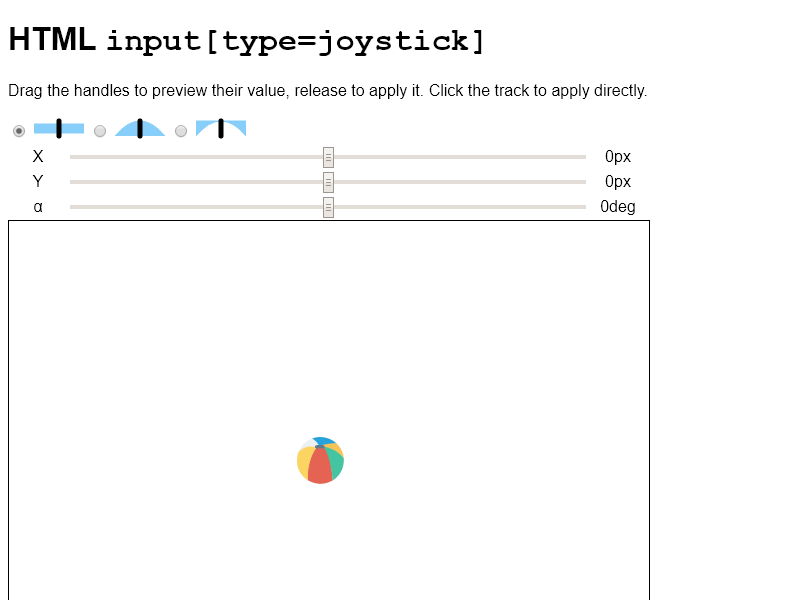

# HTML `input[type=joystick]`

This is an implementation of a programming prompt: What if range HTML inputs
behaved like console controller joysticks do?

## Running

[GitHub Pages](https://tomashubelbauer.github.io/html-input-joystick) or open
`index.html`.

## Status

Not maintained.

## To-Do

### Find a way to make the toast gradient animation smooth using two steps only

https://stackoverflow.com/q/60894337/2715716
